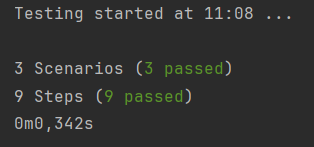
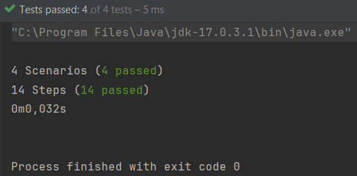

= R5.A.08 -- Dépôt pour les TPs

Ce dépôt concerne les rendus de mailto:remy.guibert@etu.univ-tlse2.fr[Rémy Guibert].

== TP1

.is_it_friday_yet.feature
[source,guerkin]
---
Feature: Is it Friday yet?
  Everybody wants to know when it's Friday

  Scenario Outline: Sunday isn't Friday
    Given today is "<day>"
    When I ask whether it's Friday yet
    Then I should be told "<answer>"
    Examples:
      | day            | answer |
      | Friday         | TGIF   |
      | Sunday         | Nope   |
      | anything else! | Nope   |
---

.Résulats des tests

== TP2

.Order.java
[source,java]
---
package dojo;

import java.util.ArrayList;
import java.util.List;

public class Order {

    private String owner;
    private String target;
    private final List<String> cocktails;
    private String message;

    public Order() {
        cocktails = new ArrayList<>();
    }

    public void declareOwner(String owner) {
        this.owner = owner;
    }

    public void declareTarget(String target) {
        this.target = target;
    }

    public List<String> getCocktails() {
        return cocktails;
    }

    public void addMessage(String message) {
        this.message = message;
    }

    public String getMessage() {
        return "From " + owner + " to " + target + ": " + message;
    }
}
---

.Résulats des tests

