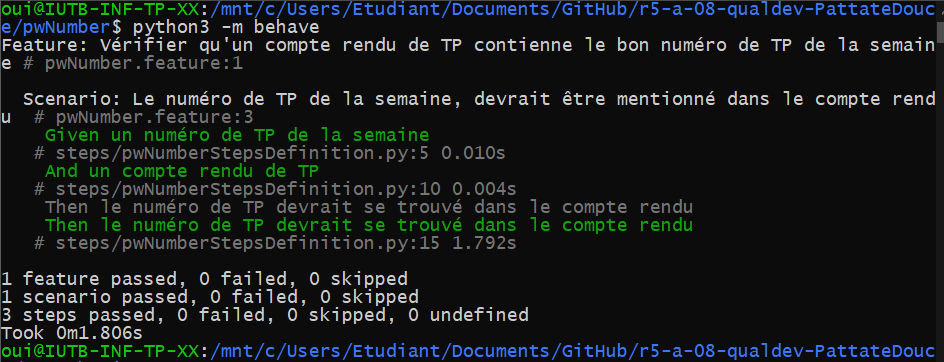
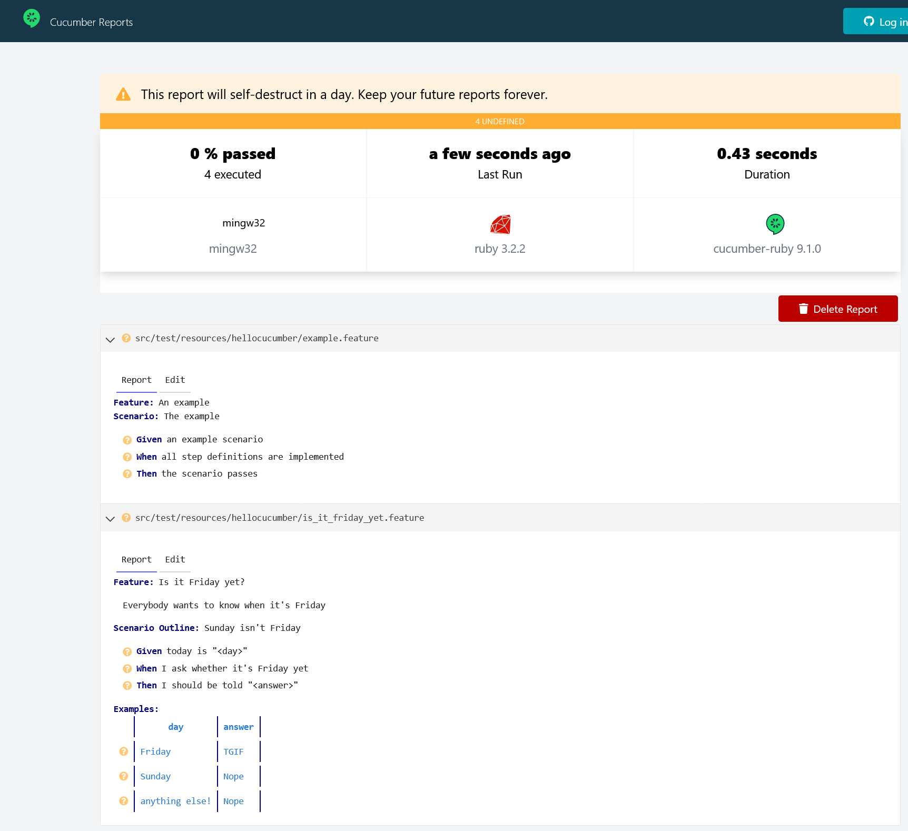
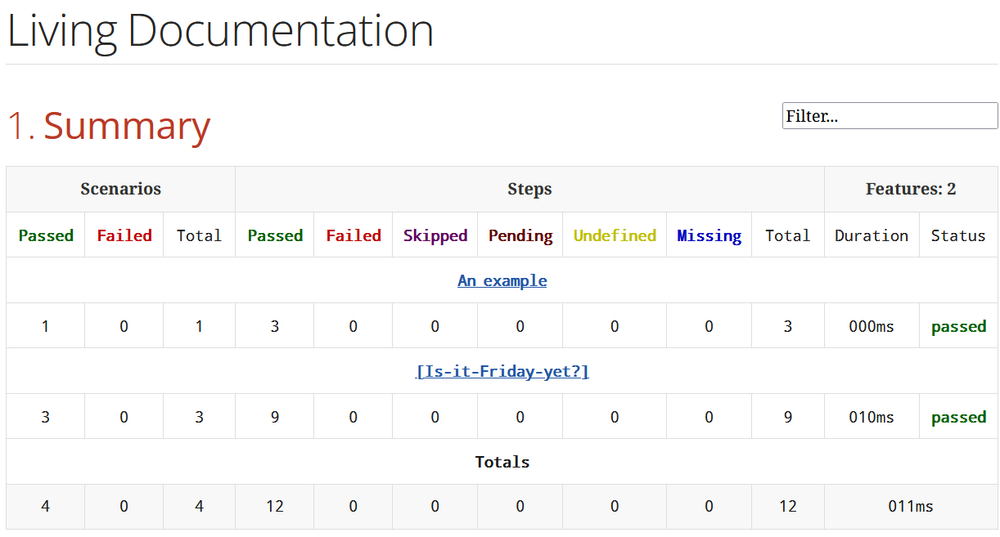

= R5.A.08 -- Dépôt pour les TPs

Ce dépôt concerne les rendus de mailto:remy.guibert@etu.univ-tlse2.fr[Rémy Guibert].

== TP1

.is_it_friday_yet.feature
[source,guerkin]
----
Feature: Is it Friday yet?
  Everybody wants to know when it's Friday

  Scenario Outline: Sunday isn't Friday
    Given today is "<day>"
    When I ask whether it's Friday yet
    Then I should be told "<answer>"
    Examples:
      | day            | answer |
      | Friday         | TGIF   |
      | Sunday         | Nope   |
      | anything else! | Nope   |
----

.Résulats des tests
image::res_tests_tp01.png[Résulats des tests TP01]

== TP2

.Order.java
[source,java]
----
package dojo;

import java.util.ArrayList;
import java.util.List;

public class Order {

    private String owner;
    private String target;
    private final List<String> cocktails;
    private String message;

    public Order() {
        cocktails = new ArrayList<>();
    }

    public void declareOwner(String owner) {
        this.owner = owner;
    }

    public void declareTarget(String target) {
        this.target = target;
    }

    public List<String> getCocktails() {
        return cocktails;
    }

    public void addMessage(String message) {
        this.message = message;
    }

    public String getMessage() {
        return "From " + owner + " to " + target + ": " + message;
    }
}
----

.Résulats des tests
image::res_tests_tp02.png[Résulats des tests TP02]

== TP3

.pwNumber.feature
[source,guerkin]
----
Feature: Vérifier qu'un compte rendu de TP contienne le bon numéro de TP de la semaine

Scenario: Le numéro de TP de la semaine, devrait être mentionné dans le compte rendu
    Given un numéro de TP de la semaine
    And un compte rendu de TP
    Then le numéro de TP devrait se trouvé dans le compte rendu
----

.pwNumberStepsDefinition.py
[source,python]
----
from behave import *
import os

@given('un numéro de TP de la semaine')
def step_impl(context):
    context.number = "07"

@given('un compte rendu de TP')
def step_impl(context):
    context.practical_work = "TP07 - Prog++ - Rémy Guibert G2.pdf"

@then('le numéro de TP devrait se trouvé dans le compte rendu')
def step_impl(context):
    print("Recherche de TP" + str(context.number) + " dans le compte rendu : " + context.practical_work)
    assert os.system("pdfgrep TP" + str(context.number) + " \"" + context.practical_work + "\"") == 0
----

L'objectif est de savoir si on a mis le bon numéro de TP dans notre compte rendu, c'est utile car quand on copie-colle son précédent compte rendu on peut oublié de changer le numéro.

.Résulats des tests

== TP4

.report.txt
[source,plain]
----
[INFO] -------------------------------------------------------
[INFO]  T E S T S
[INFO] -------------------------------------------------------
[INFO] Running hellocucumber.RunCucumberTest

Scenario: The example                       # hellocucumber/example.feature:3
  Given an example scenario                 # hellocucumber.StepDefinitions.anExampleScenario()
  When all step definitions are implemented # hellocucumber.StepDefinitions.allStepDefinitionsAreImplemented()
  Then the scenario passes                  # hellocucumber.StepDefinitions.theScenarioPasses()

Scenario Outline: Sunday isn't Friday # hellocucumber/is_it_friday_yet.feature:10
  Given today is "Friday"             # hellocucumber.StepDefinitions.todayIs(java.lang.String)
  When I ask whether it's Friday yet  # hellocucumber.StepDefinitions.iAskWhetherItsFridayYet()
  Then I should be told "TGIF"        # hellocucumber.StepDefinitions.iShouldBeTold(java.lang.String)

Scenario Outline: Sunday isn't Friday # hellocucumber/is_it_friday_yet.feature:11
  Given today is "Sunday"             # hellocucumber.StepDefinitions.todayIs(java.lang.String)
  When I ask whether it's Friday yet  # hellocucumber.StepDefinitions.iAskWhetherItsFridayYet()
  Then I should be told "Nope"        # hellocucumber.StepDefinitions.iShouldBeTold(java.lang.String)

Scenario Outline: Sunday isn't Friday # hellocucumber/is_it_friday_yet.feature:12
  Given today is "anything else!"     # hellocucumber.StepDefinitions.todayIs(java.lang.String)
  When I ask whether it's Friday yet  # hellocucumber.StepDefinitions.iAskWhetherItsFridayYet()
  Then I should be told "Nope"        # hellocucumber.StepDefinitions.iShouldBeTold(java.lang.String)
[INFO] Tests run: 4, Failures: 0, Errors: 0, Skipped: 0, Time elapsed: 0.886 s -- in hellocucumber.RunCucumberTest
[INFO] 
[INFO] Results:
[INFO] 
[INFO] Tests run: 4, Failures: 0, Errors: 0, Skipped: 0
[INFO] 
[INFO] ------------------------------------------------------------------------
[INFO] BUILD SUCCESS
[INFO] ------------------------------------------------------------------------
[INFO] Total time:  8.111 s
[INFO] Finished at: 2023-12-22T13:16:01+01:00
[INFO] ------------------------------------------------------------------------
----

.Documentation améliorée (Cucumber)

.Documentation améliorée (Cukedoctor)

